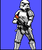
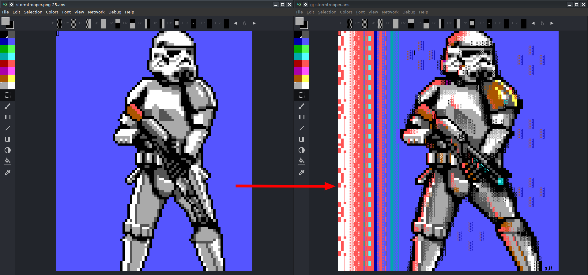
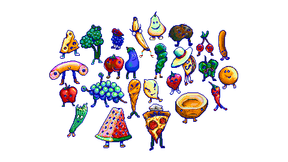
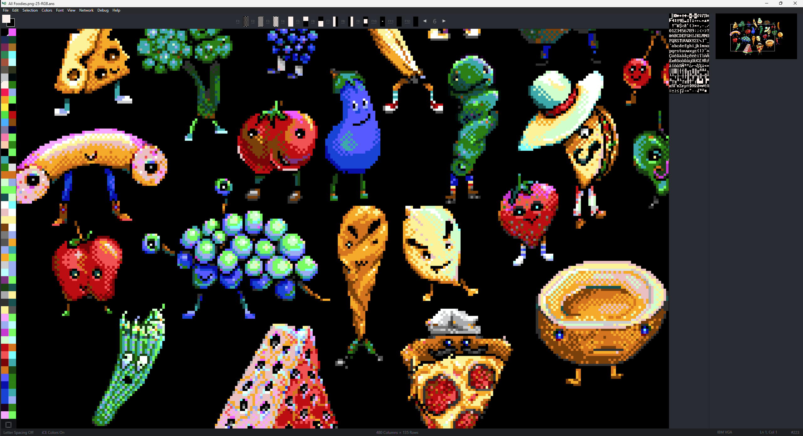
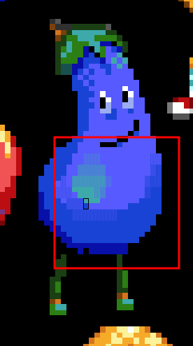
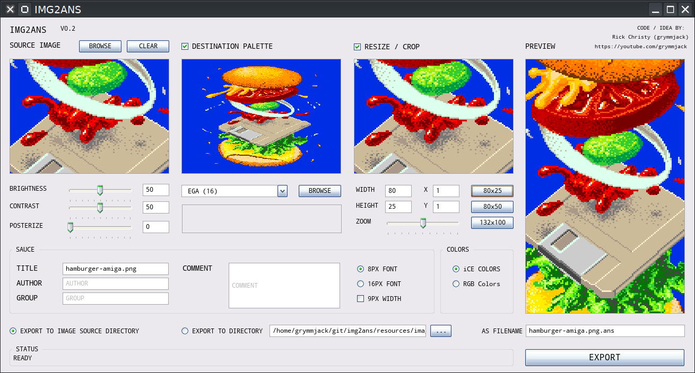

# godot version of img2ans
## TL;DR: https://www.youtube.com/watch?v=sJiqoQ2E0M8 (QB64PE version - Godot coming soon)

After struggling a bit with the [QB64PE](https://www.qb64phoenix.com/) GUI side of my project [img2ans](https://github.com/grymmjack/img2ans), I have decided to port the entire thing into godot to leverage the GUI tools available.

> Godot meets the goals I currently have.

- I want cross-platform support. Godot has this; windows, linux, mac, android, ios.
- [Godot has vscode integration](https://github.com/godotengine/godot-vscode-plugin) with debugging and supports LSP
- I can hopefully learn how the LSP is implemented once I get more familiar with Godot and use that knowledge to improve the [QB64PE vscode extension ](https://github.com/grymmjack/qb64pe-vscode) I'm working on.
- I am OK using gdscript (python-like language), and actually porting QB64PE into Godot was pretty straight forward. I'll make some videos about this process. So far it's a 1:1 simple thing to do.

Anyway, let's see where we can go with this!

We are going to build this GUI in Godot img2ans:

Or try to :)

For more information about this, 

------

`IMG2ANS` converts pixels into textmode art using [ANSI codes](https://en.wikipedia.org/wiki/ANSI_escape_code).

> Why did I make this?
There are no native ANSI editors on iOS at ALL.
The use of a remote desktop/VNC while on iOS is possible but it's just horribly unergonomic.
So, I had an idea. What if I used pixel art, and the DOS EGA/CGA [16 color palette](https://16colo.rs/artist/grymmjack) to make the pixel art, and then somehow turn it into ANSI? Voila.

#### Example Pixel Art created on iPad laying in bed because I'm old:

#### Post conversion to ANSI (Left = after conversion | Right = after refining):

#### Foodies pixel art

#### Example of Foodies (RGB 8px) conversion

#### Close-up of how to refine with shading, etc:

Now you can use the [EGA/CGA Palette](https://en.wikipedia.org/wiki/Color_Graphics_Adapter) and any pixel art editor on your devices, then convert the pixel art into text mode, and finish and refine it in editors.

`IMG2ANS` isn't the first of it's kind (GIF2ANS, etc. already exist), but I am proud of the quality of conversion. It can do a 1:1 conversion for RGB or 16 color EGA/CGA in both 8px font (80x50 mode), and 16px (80x25 mode). 

One neat thing that this does is it actually uses the ANSI block characters intelligently. Being an ANSI artist I am very picky about how I draw, and wanted to make it so that this tool would generate really easy to draw-after kinds of ANSIs. 

#### `IMG2ANS` uses the following characters:
- █ BLOCK CHARACTER - Full block foreground
- ▀ *HALF BLOCK Top FG Bottom BG*
- ▄ *HALF BLOCK Top BG Bottom FG*
- {SPACE}

*in 80x25 16px font mode only*

> So as an ANSI artist you can use stuff like `ALT-U` to pickup sensible colors, and it uses normal blocks, vs. just some weird machine-specific converter where everything is iCE colors even when it doesn't have to be, and the blocks don't make a lot of sense when you draw post conversion. Believe me it was a lot less easy to draw after conversion before! Everything used iCE colors and the background and foreground colors were all whacked and inverted. I fixed that.

Also since I know this will be helpful for BBS SysOps I have created a method which does not use iCE colors as much as possible. It will use a black where the iCE was required (if it can't compensate with lower intensity colors). 

### Cross Platform Support:
`IMG2ANS` is was originally written using [QB64-PE](https://github.com/QB64-Phoenix-Edition/QB64pe) and was a result is 100% cross platform compatible with:

- Linux
- OSX
- Windows

> The Godot version will also be cross platform and support the same OSes.

### Input Image Formats Supported:
`IMG2ANS` supports any [Godot supported image formats](https://docs.godotengine.org/en/stable/tutorials/assets_pipeline/importing_images.html#supported-image-formats) which includes:
- bmp
- dds
- ktx
- exr
- hdr
- jpg
- png
- tga
- svg
- webp

### Output Image Formats Supported:
`IMG2ANS` will save text files according to the following output types (all of which will embed the font and width and height in the sauce record in addition to the standard sauce stuff like group, author, comments, etc. if it is enabled):
- 16 color ANSI (8px and 16px fonts)
- 24 Bit ANSI (8px and 16px fonts)

### Until the Godot version GUI is done...

See the [README](https://github.com/grymmjack/img2ans) of the img2ans QB64PE project. You can use this now, but it's got no GUI. CLI only.

## USAGE FOR GUI
- Run the program
- Browse for image files to convert
- Optionally convert the source image colors to a palette
- Optionally resize / crop the image
- Enter sauce information (and optionally include it)
- Choose Font Options
- Choose Color Options
- Decide where you want to save exported converted file
- Click Export

### NEW FEATURES COMING SOON (AS PART OF GUI):
- Choose 9PX Width
- Conversion Pipeline: Open -> Palletize -> Crop/Resize
- Palettize can use any GPL palette and user palettes
- Resize / Crop nudge with arrows, resize with SHIFT
- Source Image: Brightness, Contrast, and Posterize in-line edits
- Pannable image boxes, zoomable with mousewheel
- Optional image format export using different export filename extensions
- Palette colors preview for loaded palettes
- Multiple Palette Support including user palettes in GPL format
    - 1 BIT (2)
    - CGA MODE 1 (4)
    - CGA MODE 2 (4)
    - CGA MODE 3 (4)
    - CGA MODE 4 (4)
    - EGA (16) [DEFAULT]
    - VGA (256)
    - Teletext (8)
    - APPLE ][ (16)
    - C=64 (16)
    - BBC MICRO (16)
    - ZX SPECTRUM (15)
    - AMSTRAD CPC (26)
    - ATARI 2600 NTSC (128)
    - Intellivision (16)
    - Fairchild Channel F (4)
    - SECAM (8)
    - Nintendo NES (54)
    - Nintendo Gameboy (4)
    - Nintendo SNES (256)
    - SEGA Master System (64)
    - PICO-8 (16)
    - ANSI32 (32)
    - CGA32 (32)
- Configuration:
    - Image Editor - used to edit the images in each phase of pipeline
    - ANSI Editor - used to edit the end result ANSI
    - User Palettes Directory
    - User Favorite Directories

### OPTimized

These new versions generate optimized and compressed ANSI files.

### 8px Font (80x50 mode)

This is the closest you can get to 1:1 for pixel art conversion. The converted pixel is turned into a 8x8 square character, and intended to be viewed with an 8px font (sauce configuration saved).

### 16px Font (80x25 mode)

In this mode, pixel art can be converted perfectly 1:1 but the versatility required by the 16x8px font helps so it uses full block, and half blocks to convert. It does it's best to minimize the requirement of iCE Colors.

## iCE Colors (High Intensity BG no Blink)

In traditional text mode (SCREEN 0), high intensity background colors are not allowed and will instead cause the text to blink. In iCE Color mode, the blinking is disabled. In QB64 this is the same thing that happens when you use `_NOBLINK` in text screen modes.

## RGB 24 Bit Color

If this is unchecked, the palette to be used will be the DOS CGA/EGA 16 color palette. 

If this is checked, the palette is unrestricted and `CSI;r;g;bt` method of color change is used instead.

In RGB 24 bit, you can convert any pixel art to ANSI text mode 1:1 regardless of the source color palette.

If you are not using RGB 24 bit mode, the source image must use the DOS CGA/EGA 16 color palette, or colors will not map properly for conversion.

### [SAUCE](https://github.com/grymmjack/sauce) Support
Sauce support includes:
- Font size
- iCE Colors ON/OFF
- Canvas Width
- Canvas Height
- Author
- Title
- Group
- Comments
- Date
